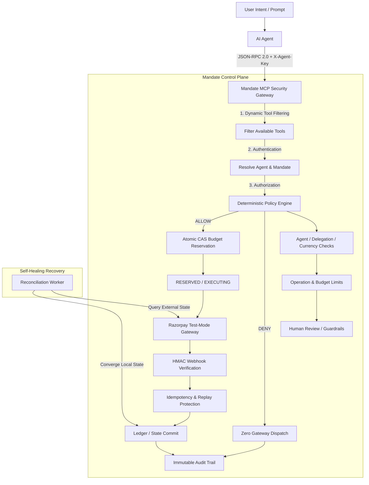

# Mandate

> **Financial authorization and control plane for AI agents operating through Razorpay APIs & MCP.**

[]()
[]()
[]()
[]()
[]()
[]()
[]()

**GitHub Repository Description**

Financial authorization and control plane for AI agents operating through Razorpay APIs & MCP

**GitHub Topics**

`ai-agents` `razorpay` `mcp` `agentic-commerce` `fintech` `authorization` `fastapi` `nextjs` `security`

---

## 1. What is Mandate?

**Mandate** is a deterministic financial authorization and control plane between autonomous AI agents and **Razorpay APIs**.

LLMs can interpret user intent, but giving autonomous agents unrestricted payment credentials or broad MCP access creates a security boundary problem: prompt injection, compromised agents, hallucinations, software bugs, and retry loops can all produce unauthorized financial actions.

Mandate places a deterministic authorization layer between the agent and the payment gateway.

It enforces:

- hierarchical authority and delegation
- deterministic policy evaluation
- dynamic MCP tool filtering
- per-operation spending limits
- aggregate budget limits
- concurrency-safe budget reservation
- human-review thresholds
- webhook authenticity and idempotency
- financial state transitions
- reconciliation after external failures
- immutable audit trails
- rate limiting and operational telemetry

The core safety property is simple:

> **A denied operation must have zero gateway effects, and concurrent authorized operations must never commit more than the mandate's aggregate budget.**

---

## 2. Core Architecture



### Authorization flow

1. Authenticate the requesting agent.
2. Resolve the applicable mandate and delegated authority.
3. Filter the MCP tool surface to only the tools permitted by that authority.
4. Evaluate deterministic authorization policies.
5. Atomically reserve the requested budget when authorization succeeds.
6. Dispatch to Razorpay only after successful authorization and reservation.
7. Verify and deduplicate settlement webhooks.
8. Commit or release the reservation exactly once.
9. Reconcile unresolved operations when external events are lost or delayed.
10. Record the complete authorization and financial state transition history.

---

## 3. Engineering Highlights

### Security

- Deterministic policy engine
- Dynamic MCP tool filtering
- Hierarchical delegation and cascading revocation
- HMAC-SHA256 webhook verification
- Webhook replay protection
- Per-agent Redis rate limiting
- Zero-gateway-dispatch invariant
- Immutable audit trail

### Concurrency & Correctness

- PostgreSQL atomic conditional-update/CAS budget reservation
- Aggregate budget enforcement under concurrent requests
- Idempotent financial operations
- Explicit financial state machine
- Property-based invariant testing
- Failure-injection testing
- Reconciliation after external state divergence

### Reliability

- Background reconciliation worker
- Recoverable webhook failures
- Duplicate/out-of-order event handling
- Gateway failure handling
- Worker restart recovery
- Database conflict handling
- Operational metrics and tracing

---

## 4. Performance & Correctness Evaluation

### 4.1 PostgreSQL Concurrency Correctness — Primary Result

> **100 / 200 / 500 concurrent PostgreSQL reservation workloads — 12 total trials — zero overspend.**

The benchmark executes the same conditional PostgreSQL `UPDATE` reservation primitive used by the API against a real PostgreSQL 16 container.

Two workloads were evaluated:

| Scenario             |     Concurrency |      Trials | Result                                                                                                                  |
| --------------------- | ---------------: | ------------: | ------------------------------------------------------------------------------------------------------------------------ |
| Independent mandates | 100 / 200 / 500 | 2 per level | All reservations admitted and accounted for; `Committed + Reserved <= Limit` held                                       |
| Shared mandate       | 100 / 200 / 500 | 2 per level | Exactly half admitted under the deliberately over-subscribed budget; remaining requests rejected through CAS contention |

#### Result

**PASS — ZERO OVERSPEND across all 12 trials**

Every trial recorded:

- zero overspend
- zero failed database operations
- correct final PostgreSQL state
- no gateway dispatches during the reservation benchmark

The reservation benchmark intentionally stops before payment settlement. Settlement correctness is tested separately through webhook and reconciliation integration tests.

Full latency tables and methodology: [`BENCHMARK_REPORT.md`](BENCHMARK_REPORT.md)

Reproduce locally:

```bash
python scripts/benchmark_concurrency.py \
  --concurrency 100,200,500 \
  --trials 2
```

> **Important:** These are local stress measurements, not production capacity claims.
>
> The benchmark was executed against Docker Compose PostgreSQL on a developer machine. The P95 latency at 500 concurrent shared-mandate requests is approximately 3.3 seconds. This demonstrates correctness under contention; it is not a production throughput or SLO claim.

### 4.2 Adversarial Authorization Evaluation

Separately from the concurrency benchmark, the authorization layer is evaluated using **1,430 deterministic simulated authorization scenarios**:

- 1,144 hostile
- 286 legitimate

These scenarios test prompt-injection-style overreach, forged financial operations, policy violations, delegation abuse, and other unauthorized actions.

| Metric                                    |                   Result |
| ------------------------------------------- | --------------------------: |
| Hostile scenarios blocked                 | **1,144 / 1,144 (100%)** |
| Unauthorized Razorpay dispatches          |                    **0** |
| Legitimate scenarios incorrectly rejected |              **0 / 286** |

The key invariant is:

> **Blocked authorization attempts produce zero Razorpay API calls.**

These are simulated authorization scenarios, not production traffic.

Run the evaluation:

```bash
python -m packages.eval.large_scale_benchmark
python -m pytest tests/test_evidence_claims.py -v
```

---

## 5. Financial State Machine & Recovery

Mandate treats payment authorization and settlement as an explicit state machine rather than a single synchronous API operation.

```text
RESERVED
    ↓
EXECUTING
    ↓
SUCCEEDED
    │
    └──→ FAILED / RECONCILED
```

The system handles:

- duplicate operation requests
- duplicate webhooks
- replayed webhooks
- delayed webhooks
- dropped webhooks
- out-of-order events
- gateway failures
- worker interruptions
- stale reservations
- reconciliation after external state divergence

The key invariant is:

> **A financial operation is committed exactly once or released exactly once.**

### Self-healing example

```text
Order created at gateway
        ↓
Webhook is dropped
        ↓
Local operation remains unresolved
        ↓
Reconciliation worker detects the discrepancy
        ↓
Worker queries external gateway state
        ↓
Local state converges to the authoritative result
        ↓
Ledger commits exactly once
```

---

## 6. Security Model

Mandate is designed around the assumption that an autonomous AI agent may be:

- manipulated through prompt injection
- compromised
- incorrectly implemented
- over-permissive
- repeatedly retrying an operation
- holding stale delegated authority

The control plane therefore does not trust the agent to enforce its own financial boundaries.

### Threats addressed

| Threat                                      | Control                                       |
| ---------------------------------------------- | ------------------------------------------------ |
| Prompt-injection-driven financial overreach | Deterministic policy evaluation               |
| Compromised agent credentials               | Agent-scoped authority                        |
| Excessive MCP access                        | Dynamic tool filtering                        |
| Delegation abuse                            | Hierarchical authority + cascading revocation |
| Concurrent overspending                     | PostgreSQL CAS reservation                    |
| Forged webhook                              | HMAC-SHA256 verification                      |
| Webhook replay                              | Idempotency protection                        |
| Duplicate payment operation                 | Idempotent state transitions                  |
| Request flooding                            | Redis rate limiting                           |
| Lost external event                         | Reconciliation worker                         |

---

## 7. Observability

Mandate exposes operational telemetry for the control plane, including:

- authorization decisions
- ALLOW / DENY / REVIEW counts
- policy failures by rule
- CAS conflicts and retries
- rate-limit rejections
- webhook replay attempts
- webhook processing latency
- reconciliation activity
- state-transition failures

The system exposes:

```text
GET /metrics
GET /health
GET /ready
```

OpenTelemetry-compatible tracing and local Grafana/Prometheus observability are included in the development environment.

The goal is not merely to measure API throughput, but to answer:

> **Why did this financial authorization succeed, fail, or require recovery?**

---

## 8. Architectural Evidence

Every major system claim is backed by implementation, automated verification, and/or an executable demonstration.

| Core Claim                           | Implementation                                               | Automated Verification                  |    Status    |
| --------------------------------------- | ---------------------------------------------------------------- | ------------------------------------------ | :------------: |
| Zero Gateway Dispatch                | `packages/policy/engine.py`, `apps/api/routes/operations.py` | `tests/test_evidence_claims.py`         | **Verified** |
| Atomic Budget Reservation            | `apps/api/routes/operations.py`                              | Evidence + PostgreSQL concurrency tests | **Verified** |
| Dynamic MCP Tool Filtering           | `packages/mcp/catalog.py`, `apps/api/routes/mcp_gateway.py`  | Evidence tests                          | **Verified** |
| Cascading DAG Revocation             | `apps/api/routes/mandates.py`                                | Evidence tests                          | **Verified** |
| Webhook Idempotency                  | `apps/api/routes/webhooks.py`                                | Evidence + replay tests                 | **Verified** |
| Self-Healing Reconciliation          | `services/worker/main.py`                                    | Recovery tests                          | **Verified** |
| Adversarial Authorization Evaluation | `packages/eval/large_scale_benchmark.py`                     | Evidence tests                          | **Verified** |
| End-to-End Lifecycle                 | Full system lifecycle                                        | `tests/test_e2e_lifecycle.py`           | **Verified** |

---

## 9. MCP Attack-Surface Reduction

Mandate dynamically exposes only the tools permitted by an agent's authority.

With 25 registered tools:

| Agent               | Available Tools | Reduction |
| --------------------- | ------------------: | -----------: |
| Procurement         |               2 | **92.0%** |
| Shopping / Buyer    |               3 | **88.0%** |
| Support / Dispute   |               3 | **88.0%** |
| Finance / Invoicing |               4 | **84.0%** |

This reduces the number of financial capabilities exposed to each agent before policy evaluation even begins.

---

## 10. Testing & Verification

Current backend verification:

```text
61 passed
1 skipped
```

The verification stack covers:

- deterministic authorization
- policy invariants
- hierarchical delegation
- webhook security
- idempotency
- state consistency
- reconciliation
- failure injection
- PostgreSQL concurrency
- Redis rate limiting
- frontend build validation

### Full verification

```bash
python scripts/verify.py
```

or:

```bash
make verify
```

For Linux/macOS:

```bash
bash scripts/verify.sh
```

### Failure / recovery tests

```bash
make chaos
```

### Concurrency benchmark

```bash
python scripts/benchmark_concurrency.py \
  --concurrency 100,200,500 \
  --trials 3
```

### Contention analysis

```bash
python loadtests/run_contention_analysis.py \
  --concurrency 100,200,500
```

---

## 11. Quickstart

### Docker Compose

Start the complete local environment:

```bash
docker compose up --build
```

This starts:

- PostgreSQL
- Redis
- FastAPI backend
- reconciliation worker
- Next.js frontend

#### Interfaces

- **Web Dashboard:** http://localhost:3000
- **Interactive Showcase:** http://localhost:3000/demo
- **FastAPI OpenAPI:** http://localhost:8000/docs
- **Health:** http://localhost:8000/health
- **Readiness:** http://localhost:8000/ready
- **Metrics:** http://localhost:8000/metrics

PostgreSQL is exposed on:

```text
localhost:5433
```

Redis is exposed on:

```text
localhost:6379
```

PostgreSQL uses host port `5433` to avoid conflicts with local PostgreSQL installations while containers continue communicating over internal port `5432`.

### Local Development

Install backend dependencies:

```bash
pip install -e ".[dev]"
```

Install frontend dependencies:

```bash
cd apps/web
npm install
cd ../..
```

Run the backend:

```bash
uvicorn apps.api.main:app \
  --host 0.0.0.0 \
  --port 8000 \
  --reload
```

Run the reconciliation worker:

```bash
python -m services.worker.main
```

Run the frontend:

```bash
cd apps/web
npm run dev
```

---

## 12. Reproducibility & Limitations

All empirical evaluations in this repository are designed to run locally.

No paid cloud infrastructure or production Razorpay transaction is required.

The following use local infrastructure:

- Docker Compose
- PostgreSQL
- Redis
- FastAPI
- Razorpay mock mode
- pytest
- Locust/load-testing tooling

### Important limitations

- PostgreSQL latency results are local-machine measurements.
- Concurrency benchmarks are not production capacity tests.
- Adversarial scenarios are simulated inputs.
- Razorpay settlement tests use mock/test-mode behavior rather than production financial transactions.
- No claim of real-world financial loss prevention is made from simulated scenarios.

The repository reports measured behavior and verified invariants rather than extrapolating local experiments into production SLOs.

---

## 13. License

Apache 2.0.

Built as a research and engineering demonstration for financial authorization of AI agents operating through Razorpay APIs and Model Context Protocol.