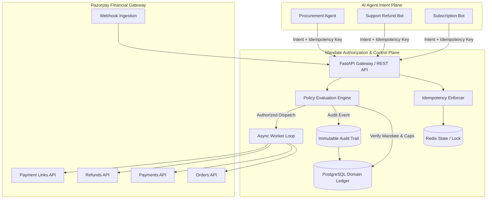

# Architecture Design — Mandate Control Plane

## High-Level System Architecture

Mandate acts as an authorization boundary and execution control plane between **AI Autonomous Agents** and the **Razorpay Payment Gateway**.

---

## Core Architectural Invariants

1. **Strict Separation of Intent vs Authorization**:
   - An AI Agent **never** holds raw Razorpay API credentials.
   - An Agent submits financial intents to the Mandate Control Plane along with a unique `idempotency_key`.
   - The Policy Engine validates the intent against active, cryptographically signed Mandates before dispatching gateway calls.

2. **Bounded Financial Authority (Mandates)**:
   - Every operation is evaluated against per-operation limits and total aggregate spend limits.
   - Mandates have explicit validity time-windows and allowed operation sets.

3. **Deterministic Idempotency**:
   - Every financial operation requires an idempotency key. Duplicate submissions return cached operations without re-executing gateway transactions.

4. **Immutable Audit Trails**:
   - Every intent, policy evaluation, mandate change, and gateway event produces an append-only audit event in PostgreSQL.

5. **Typed Gateway Abstraction**:
   - The Razorpay client layer is fully typed and supports seamless switching between Test Mode mock execution and live Razorpay sandbox APIs.
